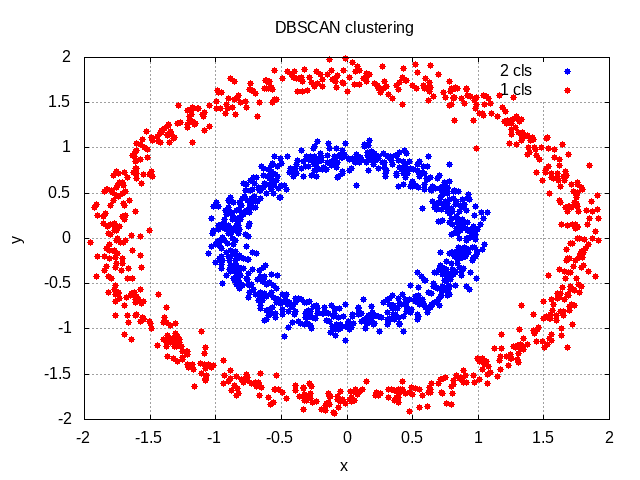

There is not a common CPP library that contains pure DBSCAN method. 
So, I built this project in order to cluster and plot
data points using DBSCAN here.
Here, we will need filesystem library(C++17 support), dlib library,
and gnuplot here.

## References ##
1: https://github.com/james-yoo/DBSCAN
(LICENSE file is included in this directory.)</br>
2: Kolodiazhnyi, Kirill. Hands-On Machine Learning with C++: Build, Train, and Deploy End-to-end Machine Learning and Deep Learning Pipelines. United Kingdom, Packt Publishing, 2020.

## Requirements ##
dlib lib.
gnuplot.

## How to do? ##
```
#Ubuntu terminal:
git clone https://github.com/mukoedo1993/DBSCAN_algorithm
cd DBSCAN_algorithm
mkdir build && cd build && cmake ..; cmake --build . --config Release
#Wait for a few minutes.
#Run:
./dbscan_cluster <target_directory> <epsilon> <minimum_points>
#e.g.: target_directory = ../data epsilon = 0.1 minimum_points = 10
# Then, just follow the instructions.
```
<br>

##  Sample  ##<br>


